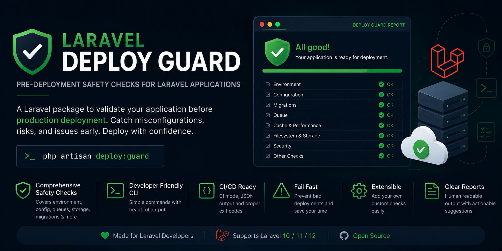

<p align="center">
    
</p>

# Laravel Deploy Guard

<p align="center">
    <a href="https://github.com/satheez/laravel-deploy-guard/actions/workflows/tests.yaml"></a>
    <a href="https://packagist.org/packages/satheez/laravel-deploy-guard"></a>
    <a href="https://packagist.org/packages/satheez/laravel-deploy-guard"></a>
    <a href="LICENSE.md"></a>
</p>

A Laravel package that checks your application for deployment risks before production release.

`laravel-deploy-guard` provides a CLI-first readiness command for local checks, staging validation, and CI/CD pipelines. It inspects common Laravel deployment risks and reports clear pass, warning, fail, or skipped results.

It does not deploy your application, run migrations, change environment files, or inspect server infrastructure.

## Documentation

- [Usage guide](docs/usage.md)
- [CI/CD guide](docs/ci.md)
- [Configuration reference](docs/configuration.md)
- [Checks reference](docs/checks.md)
- [JSON output reference](docs/json-output.md)
- [Custom checks](docs/custom-checks.md)
- [Testing and quality tools](docs/testing-and-quality.md)
- [Troubleshooting](docs/troubleshooting.md)
- [FAQ](docs/faq.md)
- [Security policy](SECURITY.md)
- [Contribution guide](CONTRIBUTING.md)
- [Change log](CHANGE_LOG.md)

## Installation

Install the package as a development dependency:

```bash
composer require satheez/laravel-deploy-guard --dev
```

Publish the configuration file:

```bash
php artisan vendor:publish --tag=deploy-guard-config
```

Run the deployment checks:

```bash
php artisan deploy:guard
```

## Quick Start

Run every enabled check:

```bash
php artisan deploy:guard
```

Run in CI mode:

```bash
php artisan deploy:guard --ci
```

Return JSON:

```bash
php artisan deploy:guard --json
```

Run selected categories or check keys:

```bash
php artisan deploy:guard --only=env,cache,migrations
```

Skip selected categories or check keys:

```bash
php artisan deploy:guard --except=mail,queue
```

Fail when warnings exist:

```bash
php artisan deploy:guard --fail-on=warning
```

Evaluate checks against a target environment:

```bash
php artisan deploy:guard --env=production
```

## Example Output

```text
Laravel Deploy Guard

Environment: production
Checks run: 22
Passed: 17
Warnings: 3
Failed: 2
Skipped: 0

FAILURES
[FAIL] env.app_debug
APP_DEBUG is enabled in a production environment.
Suggestion: Set APP_DEBUG=false before deploying to production.

WARNINGS
[WARNING] queue.connection
Queue connection is sync in production.
Suggestion: Use database, redis, sqs, or another async queue driver.
```

## Exit Codes

| Exit Code | Meaning |
|---:|---|
| `0` | No failed checks, or warnings only when warnings are allowed |
| `1` | One or more checks failed |
| `2` | One or more warnings exist and `--fail-on=warning` is enabled |

If failures and warnings both exist, the command returns `1`.

## Available Checks

| Category | Checks |
|---|---|
| `env` | `env.app_env`, `env.app_key`, `env.app_debug`, `env.app_url` |
| `database` | `database.default_connection`, `database.connection` |
| `migrations` | `migrations.pending` |
| `queue` | `queue.connection`, `queue.failed_jobs` |
| `cache` | `cache.driver`, `cache.config`, `cache.routes`, `cache.views` |
| `storage` | `storage.directory_writable`, `storage.bootstrap_cache_writable`, `storage.public_link` |
| `mail` | `mail.mailer`, `mail.production_mailer` |
| `filesystem` | `filesystem.default_disk`, `filesystem.default_disk_config`, `filesystem.cloud_disk` |
| `scheduler` | `scheduler.validation` |

See the [checks reference](docs/checks.md) for behavior, status rules, and suggestions.

## Configuration

The published config file is `config/deploy-guard.php`.

```php
return [
    'enabled' => env('DEPLOY_GUARD_ENABLED', true),

    'production_environments' => [
        'production',
        'prod',
    ],

    'checks' => [
        'env' => true,
        'database' => true,
        'migrations' => true,
        'queue' => true,
        'cache' => true,
        'storage' => true,
        'mail' => true,
        'filesystem' => true,
        'scheduler' => true,
    ],

    'allow' => [
        'sync_queue_in_production' => false,
        'array_cache_in_production' => false,
        'log_mailer_in_production' => false,
        'array_mailer_in_production' => false,
    ],
];
```

See the [configuration reference](docs/configuration.md) for all options.

## JSON Output

Use `--json` for machine-readable reports:

```bash
php artisan deploy:guard --ci --json
```

See the [JSON output reference](docs/json-output.md) for the schema and examples.

## Custom Checks

Applications can register custom checks through `config/deploy-guard.php`:

```php
'custom_checks' => [
    App\DeployGuard\SearchIndexReadyCheck::class,
],
```

See [custom checks](docs/custom-checks.md) for a complete example.

## Development

Install dependencies:

```bash
composer install
```

Run the full local quality suite:

```bash
composer test
vendor/bin/pint --test
composer rector:test
composer analyse
```

The package uses Pest, Pint, Rector, and Larastan. See [testing and quality tools](docs/testing-and-quality.md).

## Security

Reports never include secret values such as application keys, database passwords, mail passwords, tokens, or private keys. See [SECURITY.md](SECURITY.md).

## License

The MIT License.
